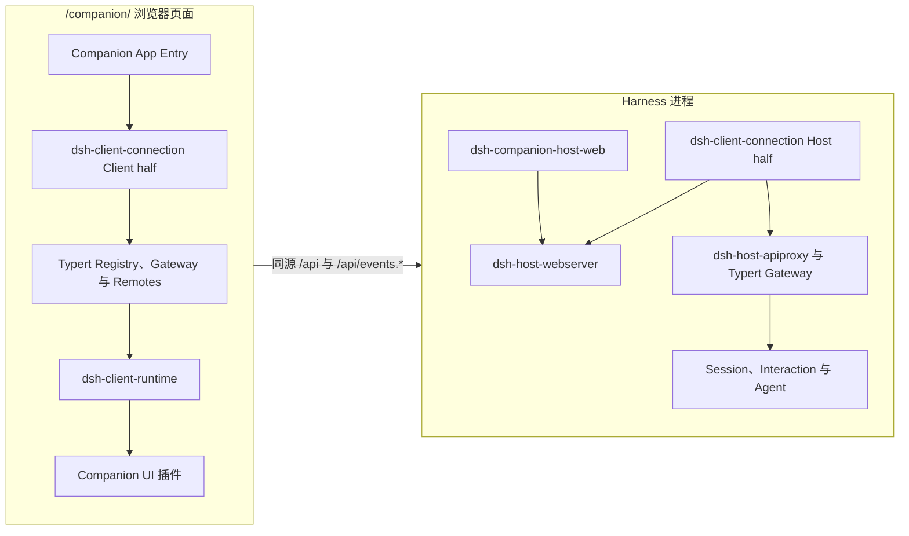

# Agent Note: Harness 同源托管的真实 Session 切片

Status: proposed

## Problem

Stage 0 证明了移动端待处理事项流程、插件装配和 Host 权威提交点，但页面只读取 Companion 自有的 Fixture。用户无法确认电脑上的真实 Harness Session、问题和审批是否已经到达 Companion，也无法通过 Companion 将一次处理结果交回正在运行的 Agent。

DeepSeek Harness 已经拥有浏览器连接、HTTP 上行、WebSocket 下行、Session 列表与历史恢复、待处理 Interaction 重放和应答载体。若 Companion 继续扩展自己的 `ConnectionFrame`、Session 投影和 Interaction 状态机，会形成第二套协议与状态实现，并要求两边分别修复重连、幂等和生命周期问题。

当前 Harness Web 载体只提供回环或显式 Host 权威信任，不提供设备认证。直接为了手机访问把服务绑定到所有网卡，会让可达性被误当成认证，不能作为真实连接的第一步。

## Proposal

本切片提供一个由 Harness 同源托管、只允许回环访问的 Companion Web 页面。它使用 Harness 已有的 Client Connection 和 Client Runtime 读取真实 Session，并完成一条真实的待处理问题或审批流程。该切片用于在电脑浏览器验证真实数据链路，是进入架构阶段 1“经过认证的直连 PWA”之前的准备工作，不宣称支持手机局域网访问。

### 用户结果

用户启动带 Companion 插件的 `dsh web`，打开同一 Origin 下的 `/companion/`，随后：

1. 在移动布局中看到真实 Harness Session 列表和待处理状态。
2. 打开一个真实 Session，查看当前问题或审批提供的必要上下文。
3. 提交答案或审批结果；界面保持进行中状态。
4. 只有 Host 的 resolved Frame 到达后，事项才从收件箱移除。
5. 连接中断时修改操作不可用；重连后从 Host 基线恢复当前待处理状态。

本阶段不提供完整电脑桌面、任意文件浏览、局域网配对、后台通知或原生打包。

### 复用结论

| 需求 | 权威实现 | Companion 的角色 |
|---|---|---|
| HTTP 上行与 WebSocket 下行 | `@deepseek-ai/dsh-client-connection` | 装载 Client half，不实现第二个载体 |
| Typert Remote | `@deepseek-ai/dsh-api-gateway/client` 与 `@deepseek-ai/dsh-api-remotes/client` | 按现有组合装载 |
| Session 列表、历史、重连与 Interaction 重放 | `@deepseek-ai/dsh-client-runtime/client` | 从 `ctx.sessions` 读取并调用 Session 行为 |
| Session、问题和审批线类型 | `@deepseek-ai/dsh-host-apiproxy` 及 Interaction 所有者包 | 只消费公开导出，不复制 DTO |
| HTTP 服务与请求信任栅栏 | `@deepseek-ai/dsh-host-webserver` 与现有 Connection Host half | 注册静态页面路由，不改变 `/api` |
| Companion 导航和待处理事项界面 | `dsh-companion` UI 插件 | 根据上游 Runtime 快照派生展示 |

Stage 0 的 `packages/connection`、`packages/connection-fixture` 和 `packages/runtime` 不是生产连接的兼容层。实现本切片时删除这些自有协议与状态实现；Fixture 流程改用上游 Connection 和 Runtime 的测试载体。项目尚未发布，不保留两套接口。

### 插件拓扑

Host 端不新增业务 Gateway。`dsh-companion-host-web` 是静态资源 Consumer：它注入现有 `webServer`，以 effect 注册 `/companion` 前缀路由，并从 Companion 构建产物提供 HTML、带哈希资源和 SPA fallback。它不占用 Harness 主 Web UI 的 fallback seat，也不读取 Session。

浏览器 App Entry 按依赖顺序装载以下公开 Client 入口：

1. `@deepseek-ai/dsh-typert-registry/client`
2. `@deepseek-ai/dsh-client-connection/client`
3. `@deepseek-ai/dsh-api-gateway/client`
4. `@deepseek-ai/dsh-api-remotes/client`
5. `@deepseek-ai/dsh-client-runtime/client`
6. Companion 的 Shell、Inbox、Session 和 Settings UI 插件

App Entry 只拥有根 Context、启动失败界面和逆序销毁。一个 `client-runtime` 实例独占 Connection 的两条下行流，Companion UI 不读取原始 Frame。

### 状态所有权与提交点

| 状态 | 所有者 | Companion 读取方式 | 提交点 |
|---|---|---|---|
| Session Log、运行状态与 Interaction | Harness | `ctx.sessions.list` 与 Session snapshot | Host Event 或完整基线 |
| 连接代次和 Host 描述 | Harness Client Connection | Connection observable | 一代握手完成或失效 |
| Session 客户端投影 | Harness Client Runtime | `ctx.sessions.binding(id)?.session` | Runtime 接受基线或连续 Frame |
| 跨 Session 待处理收件箱 | 无独立状态所有者 | 从 Session list 的 `pendingInteraction` 派生 | 上游列表快照替换 |
| 当前问题或审批 | Harness Client Runtime | 当前 Session snapshot 的 `interactions` | requested/resolved Frame |
| 表单草稿与提交中 | 对应 Companion UI 组件 | 以 `PendingWait.key` 为键的组件状态 | 用户编辑或应答 Promise 结算 |
| 当前路由 | Companion UI Shell | 浏览器 History | URL 变更 |

UI 提交问题或审批时调用上游 `PendingWait.respond()`，并使用领域所有者导出的结果类型编码值。HTTP receipt 只表示应答载体接受，不表示业务状态已经解决；只有 resolved Frame 或重连基线能够移除 Interaction。

本切片不创建第二个 Session Store，也不把收件箱持久化。刷新页面会重新连接 Host 并重建全部业务状态。

### 页面范围

收件箱继续作为首页，但条目来自真实 `SessionListState`：

- `pendingInteraction` 为 `question`、`plan-review` 或 `approval` 的 Session 排在最前。
- 运行、失败和最近更新状态直接来自 Session Summary，不根据消息文本猜测。
- 打开 Session 后只承诺展示 Header、运行状态和当前可应答 Interaction。
- 完整 Conversation 不在本切片内复制实现。后续只能复用或从 Harness 抽取共享的 Conversation Projection；禁止在 Companion 根据原始 Session Event 再写一套 Fold。

设置页显示真实 Host 版本、连接状态和“仅本机访问”。Stage 0 的“演示数据”标识只在上游 Fixture 模式出现。

### Host 静态资源插件

计划新增 `packages/host-web`：

- 注入 `webServer`，并在加载时要求 `ctx.webServer.host === '127.0.0.1'`。
- 注册 `/companion` prefix，支持 `GET` 与 `HEAD`；其他方法返回 405。
- 从 Package 自身的构建产物解析 `index.html`，不接受部署提供的任意文件路径。
- 对 `/companion/assets/*` 提供带哈希资源，对其余 `/companion/*` 返回 Companion index。
- 卸载时撤销 route；不创建后台任务或独立 HTTP server。
- 复用 Harness 静态文件服务的路径包含、MIME 和 traversal 规则；若现有 helper 的公开接口不足，先在 Harness 中提取通用 named-prefix 静态服务能力，不复制安全逻辑。

该插件与现有 Harness Web UI 可以同时装载，因为它使用 named prefix，而 Harness 主前端继续拥有唯一 fallback。

### 版本规则

当前 `host.describe` 明确假设 Host 与 Client 一起发布，没有独立协议版本。因此本切片只支持 Companion Host 插件与其浏览器产物使用同一组精确版本的 DeepSeek Harness Client Package。

- Companion 的 Harness 依赖使用精确版本，不使用 `^` 或 `~`。
- Host 插件声明相同版本的 peer dependency，并在开始提供页面前检查已解析版本。
- 版本不一致时 Host 插件加载失败，不把页面置于部分可用状态。
- 本切片不据 `host.describe.version` 发明协议兼容规则。

独立发布的手机或 PWA 客户端仍需要 Harness 拥有明确的协议版本、能力清单和设备主体。该工作属于后续认证直连阶段。

### 安全规则

- `dsh-companion-host-web` 在非回环 bind 上拒绝加载，即使部署配置了 `trustedHosts`。
- 不修改现有 `/api` Host、Origin、Fetch-Metadata 或 WebSocket upgrade 检查。
- 不增加 CORS、开发代理 Origin 重写或无浏览器标记捷径。
- 静态路由不返回 Session 数据；所有业务数据继续经过 `/api` 和现有 Parser。
- Companion 不存储 Token、设备密钥或模型凭据，也不把 Session 内容写入 URL、日志或遥测。
- 设置、凭据、打开 Host 路径等特权界面不进入本切片的移动插件清单。

### 失败与生命周期

- Host 静态资源缺失、版本不匹配、route 冲突或非回环 bind 在插件加载时失败。
- Client 插件缺失或启动失败时 App Entry 展示逐项可定位的启动错误，不渲染部分业务 UI。
- 初次连接前显示 connecting；断线后保留只读快照，但禁用所有修改操作。
- 上游 Runtime 在 generation 失效时清除 Interaction，并在新流打开后重放仍 pending 的请求；Companion 不增加自己的重连计时器。
- 提交中的组件在断线或 Interaction resolved 后结束；迟到的 receipt 不能恢复已经被 Host 移除的 Interaction。
- App Entry 卸载时逆序等待所有 Plugin Fiber dispose，最终停止 Connection stream。

### 计划改动

| 位置 | 计划 |
|---|---|
| `packages/host-web` | 新增 `/companion` 同源静态资源 Host 插件 |
| `apps/web` | 改为装载 Harness Client Package 与 Companion UI 的真实入口 |
| `packages/connection*` | 删除 Companion 自有 wire 与 Fixture Provider |
| `packages/runtime` | 删除 Companion 自有 Session/Interaction 投影 |
| `packages/ui-*` | 改为消费 `ctx.sessions`、Session snapshot 与 Connection 状态 |
| 测试组合 | 使用上游 Fixture Client 与真实 Client Runtime；增加 Host named-route 组装测试 |
| 文档 | 记录本机真实连接的启动方式和明确的非远程限制 |

## Alternatives considered

**立即实现设备认证并开放局域网。** 这最接近最终手机体验，但同时要求设备信任持久化、配对证明、请求 Principal、Scope、撤销、协议版本和恢复语义，无法用一条小切片验证。认证仍是进入非回环访问前的硬门槛，不通过弱 Token 或 Tailscale 可达性替代。

**继续扩展 Companion 的 Fixture Connection 与 Runtime。** 可以少改 Stage 0 代码，但会复制 Harness 已经拥有的 Session、Interaction、重连和错误语义。两套状态机无法共享权威测试，因此拒绝。

**直接嵌入完整 Harness Web UI。** 可以立即看到真实 Session，但保留了桌面导航和完整工作台，不能验证待处理事项优先的移动流程。本切片复用其无 React Runtime，不复用其整个界面。

**复制 `host-apiproxy` DTO 到 Companion。** 可以隔离依赖数量，但会制造第二个线协议来源，并遗漏上游 Parser 与错误扩展。Companion 只消费公开 Package 出口。

**使用独立 Vite Server 代理 `/api` 并重写 Host 或 Origin。** 开发方便，但会绕过 Harness 的同源信任证据，形成不能用于生产的第二条安全路径。开发与验收都使用 Host 提供的 `/companion` 路由。

## Acceptance criteria

- 从一个真实 `dsh web` 组合加载 Companion Host 插件后，`http://127.0.0.1:<port>/companion/` 返回 Companion 页面，Harness 主页面仍可使用。
- Host bind 为 `0.0.0.0` 时 Companion Host 插件明确拒绝启动；没有配置能跳过该限制。
- Companion 使用公开 Package 出口装载 Typert、Connection、Remotes 和 Client Runtime，不包含自有 Session 或 Interaction wire DTO。
- 一个由真实 Harness Runtime 创建的 Session 出现在 Companion 列表中；运行状态变化无需刷新即可到达。
- 一个真实 question 或 approval requested Frame 产生待处理条目；提交后 UI 防止重复操作，resolved Frame 到达前条目不消失。
- 断开两条 WebSocket 中任一条时进入只读重连状态；恢复后仍 pending 的 Interaction 被重放，离线期间 resolved 的 Interaction 不再出现。
- Host 和 Companion 的 Harness Package 版本不一致时在 Host 插件加载阶段失败。
- 单元测试覆盖收件箱派生、Interaction 提交状态和版本拒绝；Host 集成测试覆盖 prefix 静态路由、主 fallback 共存、traversal 和卸载。
- Keyless 真实组装测试通过 Harness 的 Fixture API 与真实 Client Runtime 启动 Companion App Entry。
- Playwright 在 390x844、430x932 和 1280x800 覆盖真实列表、问题或审批、提交中、resolved、断线和横向溢出。

## Risks

- DeepSeek Harness Client Package 仍处于预发布期，公开 Client face 可能调整。精确版本和一次性同步所有 Consumer 比兼容垫片更符合当前阶段。
- `dsh-client-runtime` 的依赖图比 Stage 0 Runtime 大，首屏体积会增加。实现阶段以构建产物测量为准，只在真实数据证明热点后拆分。
- 完整 Conversation 暂不进入本切片。用户能处理待办但不能在 Companion 查看全部上下文；验收必须确保问题或审批 Payload 已提供作出决定所需的信息，不足时停止切片而不是从原始 Event 临时拼装。
- Named-prefix 静态资源 helper 的复用出口尚需在实现开始时验证。若 Harness 当前只公开 fallback 插件，先在其所有者包增加通用 prefix 服务并接受对应安全测试。
