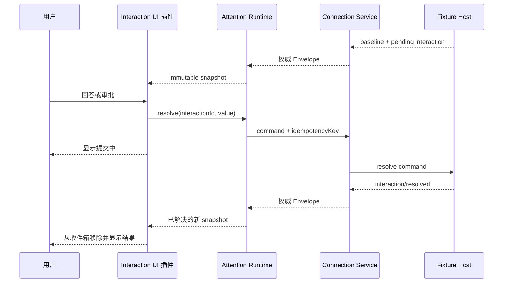

# Agent Note: 以待处理事项为中心的首个移动端纵向切片

Status: proposed

## Problem

当前架构确定了移动优先、插件组合和 Host 权威状态，但还没有一条足够窄、可以直接实现和验证的用户流程。若先分别搭建通用路由、完整对话、真实认证和所有 Harness Tool 展示，会同时产生多个未闭合 Package，难以验证插件边界是否真正支持移动工作，也会在远端协议确定前把 Fixture 假设写进产品接口。

用户离开电脑后最有时间价值的行为不是浏览完整终端，而是发现 Agent 正在等待自己，理解上下文，作出一次回答或审批，并确认电脑端已经接受处理。第一条切片需要贯穿这一结果，同时不宣称尚未实现的远程认证可用。

## Proposal

阶段 0 实现一个由确定性 Fixture Provider 驱动的响应式 Web 应用，覆盖以下工作流：用户从待处理收件箱看到一个问题或审批，进入所属 Session 查看上下文，提交回答或决定，界面保持进行中，直到模拟 Host 发出权威 resolved 事件后从收件箱移除该事项。应用随后模拟断线和重新获取基线，已处理事项不得重新出现。

Fixture 只替代 Host 和网络，不替代 App Entry、Cordis 插件装配、客户端 Runtime、路由或 React UI。阶段 1 的真实 Connection Provider 必须能在不修改 Consumer 的情况下替换 Fixture Provider。

### 用户流程

点击操作不会直接把事项标记为已解决。客户端可以记录以幂等键标识的本地提交中状态并禁用重复点击；只有 Host 的 resolved 事件或包含相同结果的新基线代表提交完成。命令响应丢失时，Runtime 保留该幂等键并在恢复后查询权威状态，不盲目生成第二个命令。

## Plugin topology

首个切片使用以下职责，不预先为每个角色建立独立 Package：

| 单元 | 角色 | 当前职责 |
|---|---|---|
| `apps/web` | Shell | 启动 Loader、提供插件清单、挂载根 Renderer、展示启动失败 |
| `packages/connection` | Service Definition | 描述 Host、执行带幂等键的命令、订阅 Envelope、暴露 Connection 生命周期 |
| `packages/connection-fixture` | Service Provider | 从场景文件产生基线、事件、延迟、断线和稳定业务错误 |
| `packages/session-runtime` | Consumer + client state | 把基线与 Session Event 投影为可丢弃的不可变 Session Snapshot |
| `packages/attention-runtime` | Consumer + client state | 从权威 Interaction 状态派生跨 Session 收件箱，并协调修改请求 |
| `packages/ui-shell` | UI composition | 提供导航、页面和状态 Slot，不保存 Session 业务数据 |
| `packages/ui-inbox` | UI Consumer | 展示待处理事项、筛选状态并导航到 Session |
| `packages/ui-session` | UI Consumer | 展示 Session 上下文、Conversation 摘要和 Connection 状态 |
| `packages/ui-interaction` | UI Consumer | 展示问题与审批，收集输入并调用 Attention Runtime |
| `packages/platform-web` | Platform Provider | 浏览器可见性、存储和网络状态接口；阶段 0 不提供生产通知 |

若 `session-runtime` 与 `attention-runtime` 在实现中共享同一事件窗口、生命周期和发布点，应先合并为一个 Runtime Package；只有出现独立 Consumer 或独立发布节奏后再拆分。目录名称表示当前职责，不提前决定 npm 发布名称。

### UI slot

`ui-shell` 定义而不实现业务内容的 Slot：主导航目的地、收件箱条目、Session 顶部状态、Conversation Node、Session 内联操作和设置区块。Contribution 注册返回 disposer，并包含稳定 id、排序信息、可见性条件和 Renderer。Slot 不接受任意远端 JavaScript；Host Capability 只能决定已经打包的本地 Contribution 是否激活。

## State ownership

| 状态 | 所有者 | 权威来源与提交点 |
|---|---|---|
| Session 与 Interaction 业务状态 | Harness；阶段 0 为 Fixture Host | Host baseline 和有序 Envelope |
| 客户端 Session Snapshot | Session Runtime | 最近一次完整基线加连续事件；可全部丢弃重建 |
| 跨 Session 收件箱 | Attention Runtime | 从 Session Snapshot 派生，不独立持久化 |
| 修改请求进行中状态 | Attention Runtime | `interactionId + idempotencyKey`；resolved 事件后结束 |
| 当前路由和选中 Session | UI Shell | URL 和 Shell Store |
| 表单草稿、展开状态 | 对应 UI 插件 | 组件状态；离开页面是否保留由该插件明确决定 |
| Connection 代次和重连状态 | Connection Provider | 单个 lifecycle controller |

Runtime 对 React 暴露 immutable snapshot 与 subscribe 接口。UI 不直接消费原始 Envelope，也不维护第二份 pending interaction 列表。相同业务更新只替换受影响实体及必要索引的引用，以便 React Selector 隔离刷新。

## Connection lifecycle

Connection Provider 为每个连接代次创建一个 AbortController，并由一个 controller 拥有 `start`、readiness、事件 Pump、失败、退避、重连和 `dispose`。进入后台或浏览器冻结后，客户端把当前流视为不可恢复；回到前台重新认证并请求从 opaque cursor 恢复，或接受 Host 的 replace-baseline 指令。

阶段 0 Fixture 必须模拟以下路径：首次基线、流中断后恢复、cursor 被拒绝后替换基线、命令响应丢失但 resolved 事件到达、resolved 事件丢失后通过新基线收敛，以及插件卸载时等待所有 Pump 停止。

事件序列出现未知缺口时，Runtime 进入 `resyncing`，保留只读旧内容但禁用修改操作；不能把后续事件直接接到不完整投影。重连状态由 Connection Runtime 发布，UI 只负责展示和禁用相应命令。

## Failure model

用户界面区分以下失败，不用一个“网络错误”覆盖全部情况：

| 类别 | 产生位置 | 首个切片行为 |
|---|---|---|
| Boot/config | App Shell 或 Loader | 独立启动失败页，不挂载半套功能 |
| Compatibility | Connection readiness | 请求 Session 前阻止进入，显示 Host 与 Client 版本 |
| Authentication | Connection Provider | 清除活动 Connection，保留 Host 描述并要求重新配对 |
| Authorization | Host 业务入口 | 保留只读上下文，隐藏或禁用不具备 Scope 的操作 |
| Transport | Connection Provider | 进入 reconnecting/resyncing，不宣称命令失败或成功 |
| Stale interaction | Host Interaction owner | 获取新状态；若已由其他客户端处理，展示处理结果 |
| Validation | Service Definition 或 UI input | 保留用户输入，并在最接近字段的位置显示错误 |
| Business | 对应 Host capability | 保留类型化 code，交由拥有该操作的 UI 插件展示 |

Fixture 场景必须使用与未来线协议相同的错误联合类型，不能直接抛出只在测试里存在的字符串。

## Mobile interface

首屏为收件箱，顶部紧凑显示当前 Host 和 Connection 状态，主体按“需要立即处理、失败、已完成”排序。底部使用收件箱、Session、设置三个导航目的地。待处理条目直接显示类型、Session、Workspace、请求来源和短上下文；主要操作进入 Session 内完成，避免在列表中展示缺少上下文的危险确认按钮。

Session 页面使用一个主内容列：紧凑 Context Header、Conversation、内联 Interaction、底部输入区。审批必须显示 Tool 名称、风险摘要和 Harness 提供的安全展示字段；阶段 0 不展示任意原始 JSON 作为默认批准依据。桌面视口允许左侧 Session 导航和右侧主内容，但状态与插件保持相同。

界面必须实现加载、空、断线、重新同步、无权限、已过期、提交中、提交完成和启动失败状态。不得用说明卡片代替真实工作界面。

## Boundaries

阶段 0 明确标记为 Fixture，不连接真实 Harness，也不提供生产配对。浏览器本地存储只保存 Fixture 场景选择和非敏感 UI 偏好。

阶段 1 替换 Connection Provider 前，Harness 仓库必须拥有并实现：线协议 DTO 与 Parser、协议和 Capability 协商、设备认证主体、请求 Scope 检查、Interaction 的稳定 ID 与 resolved 事件、修改请求幂等，以及断线恢复或新基线语义。Companion 不复制这些 Schema 作为第二个来源。

## Verification plan

### Unit

- 基线与连续事件产生确定性 Snapshot。
- 序列缺口使 Runtime 进入 `resyncing` 并禁用修改操作。
- 收件箱完全从权威 Interaction 状态派生。
- 重复点击复用进行中的幂等键；resolved 后才移除事项。
- stale、authorization 和 transport error 保留不同类型。
- 插件 disposer 移除 Contribution、监听器和未完成请求。

### Real composition

通过 `apps/web` 的真实插件清单启动 Fixture 场景，不由测试直接构造 Runtime。至少覆盖一个问题、一个审批、一次竞争解决、一次断线恢复和一次 replace-baseline。

### Browser

Playwright 在 390x844、430x932 和 1280x800 视口运行完整流程，检查无横向溢出、主要操作可触达、虚拟键盘尺寸变化不遮挡输入、长中文和英文不覆盖控件。截图覆盖收件箱、Session 待处理、提交中、已解决、断线和启动失败。

浏览器流程还要验证浏览器刷新后由 Fixture 基线重建相同业务状态，而不是从 UI Store 恢复一份独立 Session 副本。

## Alternatives considered

**先复制 Harness 现有 Web 客户端。** 可以快速得到 Conversation 页面，但会把桌面导航、同版本同源连接和现有 Package 边界一起带入，无法证明独立移动客户端需要的认证、恢复和注意力工作流。

**第一步直接实现真实远程认证。** 安全价值高，但当前上游线协议、设备身份和恢复语义尚未实现。把这些与首个 UI 切片同时开发会让客户端接口追随临时 Host 实现变化。

**以通用终端流作为首个协议。** 容易看到电脑输出，但审批、问题、Session 状态和操作者来源会退化为无法可靠解析的文本，也绕过 Harness 已有的结构化语义。

**根据 Host Schema 自动生成所有操作表单。** 看似贯彻插件化，实际允许未知远端数据决定高风险修改界面。原生客户端只激活随应用签名发布的功能插件，未知能力默认只读。

**先搭建所有 Package 空壳。** 会产生大量没有 Consumer 证据的抽象和配置。本提案只创建闭合首个流程需要的单元，并允许在共享生命周期得到实现证据后合并 Runtime Package。

## Acceptance criteria

- 从仓库标准开发命令可以启动响应式 Web 应用，电脑浏览器无需安装原生 SDK 即可查看。
- 真实 App Entry 加载全部首切片插件，Shell 不包含收件箱、Session 或 Interaction 业务分支。
- 用户可以从收件箱进入 Session，回答问题和作出审批，并只在权威 resolved 状态后看到事项消失。
- 响应丢失、重复点击、其他客户端抢先处理和断线重连都不会重复执行修改操作。
- 事件缺口触发新基线，修改操作在状态收敛前不可用。
- 每项注册在插件卸载后消失，Connection dispose 返回时所有异步 Pump 已停止。
- 目标手机与桌面视口覆盖全部规定状态，没有横向溢出、遮挡或触摸目标漂移。
- Fixture 与未来真实 Connection 共享公共类型；UI 和 Attention Runtime 不导入 Fixture 实现。
- README 明确 Fixture 限制，不把阶段 0 描述为安全的远程控制产品。

## Risks

**Fixture 可能反向定义线协议。** 公共 Connection 接口只表达客户端当前需要的能力，不声明最终 DTO 字段；阶段 1 以 Harness 所属 Wire Package 为权威并允许调整当前提案。

**Runtime Package 可能过早拆分。** Session 与 Attention 可能共享事件窗口和提交点。实现前先用一个模块验证，只有出现独立消费者或生命周期才拆包。

**移动审批缺少足够上下文。** 首切片只支持 Harness 能提供安全展示意图的审批；缺少风险摘要或目标信息时只允许跳转到电脑处理，不退化为原始参数确认。

**乐观反馈和权威确认之间可能显得迟缓。** UI 显示提交中和连接状态，但不提前伪造完成。若真实延迟不可接受，应优化 Host 确认事件，而不是在客户端增加第二份业务事实。

## Open decisions before implementation

- `session-runtime` 与 `attention-runtime` 是否共享一个生命周期和 Package，需要用最小事件投影原型确认。
- Harness 当前 Interaction Event 是否已经提供移动审批所需的安全展示字段；缺失时应先在 Harness 设计展示意图。
- 阶段 0 的场景文件使用 Harness Canonical Session Event 子集，还是使用 Companion Wire DTO Fixture；必须由未来 Wire Package 的所有权决定，不能维护两套手写 Schema。
- 首个脚手架采用现有 Harness Client Package 作为 workspace dependency，还是先发布最小 Wire-only Package；在依赖和发布策略确定前不开始产品 Connection 实现。
