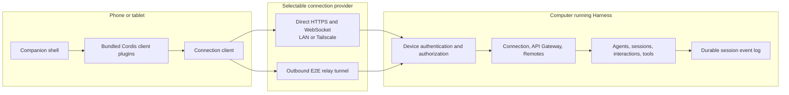

# DSH Companion Architecture

English | [中文](architecture.zh.md)

Status: initial architecture baseline

Engineering rules and the pre-code design procedure live in [AGENTS.md](../AGENTS.md) and the current [Chinese design workflow](design-workflow.zh.md). The current Stage 0 implementation is recorded in the [attention-centered mobile workflow decision](../.agents/notes/implemented/feature/2026-08-15-attention-workflow-first-slice.md).

## 1. Purpose

DSH Companion is a mobile-first client for DeepSeek Harness. It allows a person to supervise work that continues on a computer: observe sessions, respond to requests for attention, send or queue input, steer an active turn, stop work, and inspect results.

Companion does not execute tools, mount workspaces, hold model credentials, or implement an agent loop. Those responsibilities remain in Harness. This separation keeps filesystem and process access on the computer where the project lives and preserves the Harness session log as the authoritative record.

## 2. Architecture decisions

The initial design makes these decisions:

1. Companion uses the application-facing Harness Remote and Gateway APIs. ACP remains an automation interoperability protocol and is not the mobile presentation protocol.
2. The first product is a Host-served responsive web application. Host and web client artifacts therefore ship together while the remote protocol is being prepared for independent clients.
3. The native application uses the same web feature packages inside a thin Capacitor shell. A React Native or Flutter rewrite is not part of the initial plan.
4. Direct authenticated HTTPS and WebSocket access over LAN or Tailscale is the first transport. A public relay is optional and comes later.
5. The mobile home screen is an attention inbox, not an empty chat composer.
6. Native releases bundle executable plugin code with the signed application. A Host sends capability data, never arbitrary JavaScript for a native client to execute.
7. Authentication, authorization, transport, notifications, and UI features are separate plugin responsibilities.

## 3. System boundaries

### 3.1 Harness Host

Harness owns:

- Agent creation, lifecycle, execution, cancellation, and continuation.
- The append-only session event log and every projection derived from it.
- Tools, approvals, questions, permission policy, jobs, goals, and workflows.
- Workspace, filesystem, subprocess, terminal, and model-provider access.
- Durable device records, authorization grants, and revocation.
- Validation and authorization of every client operation.

### 3.2 Companion client

Companion owns:

- Host discovery and pairing UX.
- Device key storage and connection state.
- Local presentation caches that can be discarded and rebuilt.
- Mobile navigation, attention inbox, conversation rendering, and input.
- Native adapters for QR scanning, notifications, camera input, deep links, and secure storage.
- Capability-aware activation of client plugins bundled with the application.

### 3.3 Optional relay

The relay owns connection rendezvous and opaque message delivery. It does not own agent state, authorize Harness operations, or receive plaintext prompts, session events, tool data, diffs, or workspace data.

## 4. Deployment topology



### 4.1 Host-served web mode

Harness serves the Companion web assets and boot manifest from the same trusted origin as its API. This mode is version-locked to the running Host and is the fastest path to a usable preview. It reuses the existing browser Connection carrier: unary operations use HTTP POST and live Host and interaction downlinks use WebSocket.

The web build may use the Host-selected browser plugin graph because the Host and web artifacts form one deployment. A production PWA still requires device authentication before non-loopback access is enabled.

### 4.2 Native mode

The Capacitor application packages the shell, Cordis runtime, feature plugins, and generic renderers in the signed app. The Host returns a versioned capability inventory during the readiness handshake. The client activates compatible local plugins and uses generic presentation for recognized data that has no specialized renderer.

The native app never downloads executable plugin bundles from a paired Host. This keeps the release review surface finite and prevents a compromised Host from replacing application code.

### 4.3 Relay mode

Both the Host and Companion establish outbound connections to a relay. Pairing establishes end-to-end session keys between the devices; the relay forwards encrypted envelopes and limited routing metadata. Relay availability does not weaken Host authorization: every decrypted request still enters the same authenticated principal and scope checks as a direct request.

Relay mode is not required for the first release. Tailscale or another private network supplies reachability for the direct mode without adding a service that stores ciphertext and connection metadata.

## 5. Plugin architecture

Everything user-visible or deployment-varying is composed through Cordis plugins. The app shell makes no product feature decisions beyond starting the client Loader and rendering boot failure.

### 5.1 Companion repository ownership

The planned repository layout is:

```text
apps/
  web/                       Host-served responsive PWA entry
  native/                    Capacitor projects and signed static plugin catalog
packages/
  connection/                Connection Service Definition and minimal Frame types
  connection-fixture/        Deterministic Stage 0 Provider
  runtime/                   Unified authoritative Session and Attention projection
  ui-shell/                  Route Registry and responsive Shell
  ui-inbox/                  Cross-Session pending and outcome inbox
  ui-session/                Session, Conversation, question, and approval UI
  ui-settings/               Host, connection, trust, and plugin status
docs/
  architecture.md
```

Package publishing names are deferred until the repository's npm ownership and release channel are decided. Folder boundaries above describe responsibility, not final package names.

### 5.2 Harness repository ownership

The following work belongs in `deepseek-harness`, not in Companion:

- Protocol version and capability fields in `host.describe`.
- A publishable, wire-only client contract containing DTO types, parsers, error codes, and carrier interfaces.
- Device trust records and the authentication service definition.
- A paired-device authentication provider and a Connection authorization consumer.
- Request scope checks and durable actor provenance.
- Replay or fresh-baseline behavior for reconnecting independent clients.
- Notification service definition and Host-side attention event consumer.
- Optional outbound relay Connection provider.

Companion must consume these contracts. It must not copy Host request schemas into a second source of truth.

### 5.3 Capability seams

Each new Harness capability is complete across its three roles.

| Capability | Service Definition | Providers | Consumers |
|---|---|---|---|
| Device trust | Verify a device principal, inspect grants, revoke trust | Paired public-key provider; test-memory provider | Connection authentication and authorization |
| Remote carrier | Carry authenticated request/response and downlink envelopes | Direct HTTP/WebSocket; outbound relay | API Gateway and event delivery |
| Notifications | Deliver a secret-free attention signal to a registered device | Web Push; APNs/FCM adapter; disabled provider | Approval, question, failure, and turn-completion projector |

Registrations use effects and unwind when their plugin unloads. New behavior attaches to the Connection, Remote, session event, and interaction extension points; it does not modify the agent loop.

## 6. Client composition

The client is divided into four layers:

1. Shell kernel: boots the module catalog, Cordis Loader, error surface, and root renderer.
2. React-free runtime: owns Host connections, session objects, projections, history windows, caches, and slot data sources.
3. Feature plugins: contribute inbox rows, conversation nodes, tool views, commands, jobs, goals, models, attachments, and settings surfaces.
4. Platform plugins: implement web or Capacitor access to storage, notifications, QR scanning, camera input, deep links, and application lifecycle.

Feature plugins depend on capability interfaces and UI slots rather than on Capacitor. Platform-specific behavior is injected, allowing the same feature package to run in the desktop browser, mobile browser, and native WebView.

## 7. Protocol requirements

An independently released client cannot rely on the current assumption that Host and Client always ship together. The readiness response must include at least:

```ts
interface CompanionHostDescription {
  protocol: {
    major: number
    minor: number
  }
  host: {
    id: string
    name: string
  }
  capabilities: Array<{
    id: string
    version: number
  }>
  principal: {
    deviceId: string
    scopes: string[]
  }
}
```

The exact type belongs to the Harness wire-contract owner. This example records the required information, not final field names.

### 7.1 Compatibility

- A different protocol major version fails before session data is requested.
- A newer minor version is accepted when all required capabilities are compatible.
- Missing optional capabilities hide or replace their owning UI contribution.
- Unknown capability ids are retained as data but do not activate code.
- Business errors remain typed and distinct from carrier, authentication, and compatibility failures.

### 7.2 Requests

Every mutating request carries a client-generated idempotency key. Repeating a request after a lost response must either return the original result or a stable conflict; it must not submit the same prompt, approval, or command twice.

The authenticated Connection supplies the device principal. Business payloads do not accept a caller-selected `deviceId` or scope list.

### 7.3 Event delivery and recovery

Live streams use an opaque resume cursor owned by the Host stream implementation. On reconnect, the Host either resumes after that cursor or instructs the client to replace its state from a fresh baseline. The client never assumes that receiving only later events can repair an unknown gap.

Session events retain their authoritative sequence numbers. Projection updates remain higher-sequence-wins. Pending approvals and questions use stable request ids and explicit resolved events so reconnect replay cannot recreate an action that has already been answered elsewhere.

## 8. Identity, pairing, and authorization

### 8.1 Pairing flow

1. A local Harness command or trusted Host page creates a single-use pairing offer with a short expiry.
2. The offer is shown as a QR code containing the Host address, Host identity fingerprint, offer id, and expiry. It contains no reusable bearer credential.
3. Companion creates or loads its device identity from secure local storage and presents proof through an established authenticated key-exchange implementation.
4. Harness verifies the one-time offer, records the device public identity, and returns the granted scopes.
5. Both sides display a short verification code or fingerprint before granting control scopes.
6. The offer is consumed atomically. Reuse, expiry, or a mismatched Host identity fails closed.

Cryptographic primitives and handshake state machines must come from maintained, reviewed dependencies. This project does not define a new cryptographic protocol.

### 8.2 Scopes

The initial scope vocabulary is:

| Scope | Allows |
|---|---|
| `session:read` | List authorized sessions and read their transcripts and projections |
| `session:prompt` | Create a session and submit or queue user input |
| `session:control` | Steer, interrupt, resume, archive, and rename sessions |
| `interaction:answer` | Resolve approval, question, and plan-review requests |
| `workspace:review` | Read bounded workspace metadata and diffs exposed by a review API |

The initial mobile grant excludes settings, credentials, Host-native dialogs, arbitrary filesystem browsing, plugin authoring, and permission-policy escalation. Those operations need separately designed scopes and confirmation UX before remote exposure.

### 8.3 Revocation and provenance

Harness owns the trusted-device list. A local operator can revoke a device immediately; every active connection and pending request associated with it is terminated.

Every remote prompt, command, steering input, approval decision, and answer records its authenticated actor provenance in the durable event that already represents the action. Model-visible input must remain reconstructable from the session log, including its source device. Secrets and raw authentication material never enter session events.

## 9. Security model

The design addresses these threats:

- A device on the same LAN can reach the Host but is not paired.
- A DNS rebinding or cross-origin browser request targets the Host API.
- A relay or reverse proxy observes or modifies traffic.
- A captured QR code is replayed after pairing or expiry.
- A paired phone is lost and later revoked.
- Two clients race to answer the same approval or question.
- A stale notification opens after another client resolved the request.
- A compromised Companion cache contains old session content.

Security rules:

- Reachability checks remain in place but never substitute for authentication.
- Direct production connections use HTTPS/WSS, including a private-network HTTPS endpoint such as Tailscale Serve. Plain HTTP is limited to loopback development.
- Relay payloads use end-to-end authenticated encryption with replay protection.
- Authorization runs on every request using the Connection principal and current Host grants.
- Push payloads carry only opaque Host, session, and attention identifiers plus a coarse category. The app fetches current state after opening.
- A notification never contains prompts, tool arguments, diffs, paths, model output, or credentials.
- Native clients store long-term private keys in Keychain/Keystore through the platform plugin. The PWA uses a same-origin, non-exportable WebCrypto key when the browser supports it and exposes the weaker browser-profile trust model during pairing.
- Cached transcript data is minimized, encrypted by platform storage where retained, and safe to discard.
- Sensitive Host configuration APIs stay unavailable to remote principals in the initial release.

## 10. State ownership

Harness is authoritative for all product state. Companion may persist:

- Paired Host descriptors and public identity fingerprints.
- Device private identity in secure storage.
- Non-secret UI preferences.
- Bounded encrypted presentation cache and last acknowledged resume cursor.
- Pending local drafts and unsent operations with idempotency keys.

Companion does not persist model credentials, Host settings documents, permission defaults, complete workspace trees, or an independent session event log.

When foregrounded after suspension, the app treats its connection as lost, reauthenticates, and requests resume or a fresh baseline before enabling actions. This accommodates mobile operating systems that suspend WebSockets in the background.

## 11. Mobile information architecture

### 11.1 Primary navigation

The first release has three top-level destinations:

- Inbox: approvals, questions, plan reviews, failures, and newly completed sessions across paired Hosts.
- Sessions: grouped Host/session list with running, idle, failed, and needs-attention states.
- Settings: Host pairing, device trust, notifications, appearance, and diagnostics. It does not expose Harness model credentials or plugin configuration.

### 11.2 Session screen

The session screen contains:

- Compact Host, workspace, session, model, and permission context.
- Streaming conversation and structured tool presentation.
- A composer that supports submit, queue, and steer according to current Agent state.
- Explicit interrupt and retry actions.
- Inline approval, question, and plan-review composers.
- A later review tab for bounded diffs and produced files.

The layout uses one primary pane on phones. Tablet and desktop viewports may show session navigation beside the conversation, but the same plugins and state owners remain active.

### 11.3 Unknown features

An older Companion client may meet a newer Host plugin. Unknown session events remain governed by the Harness session format. Unknown optional UI capabilities render a generic labeled state when safe, or no action when the client cannot prove how to answer. The app never fabricates a generic mutating form from an unknown operation schema.

## 12. Delivery phases

### Phase 0: visual contract

- Fixture-driven responsive web shell.
- Inbox, session list, session conversation, approval, question, and plan-review walkthroughs.
- Desktop browser testing at phone and tablet viewport sizes.
- No remote Host connection and no security claims.

### Phase 1: authenticated direct PWA

- Upstream protocol version and capability negotiation.
- Device-trust capability with QR pairing, scopes, and revocation.
- Direct HTTPS/WebSocket carrier over LAN or Tailscale.
- Session lists, history, live stream, prompt, queue, steer, interrupt, and interactions.
- Foreground resynchronization and idempotent mutations.

### Phase 2: installable and native surfaces

- Service worker and bounded static-asset cache for the PWA.
- Web Push where the deployment supports it.
- Capacitor iOS and Android packaging.
- Keychain/Keystore, QR scanner, native push, camera attachment, deep links, and share target.
- Signed static client plugin catalog and compatibility fallback.

### Phase 3: optional relay

- Outbound Host relay provider.
- End-to-end encrypted envelopes and replay protection.
- Self-hosted relay deployment.
- Push routing that reveals no session content.
- Multi-Host selection and connection health diagnostics.

### Phase 4: review workflows

- Bounded diff and produced-file review.
- Review comments or structured follow-up prompts.
- Carefully scoped Git operations only after a separate authorization design.

## 13. Acceptance requirements

Every release path must prove:

- No horizontal overflow or overlapping controls at 390x844 and 430x932 viewports.
- Touch targets, safe-area insets, virtual keyboard resizing, and long CJK/English content remain usable.
- A dropped downlink reconnects without duplicating messages or reopening resolved interactions.
- Repeating a timed-out mutation does not repeat its action.
- A stale approval answer and stale notification fail safely.
- Revocation terminates active and future requests from the device.
- A protocol-major mismatch fails before session content is displayed.
- Missing optional capabilities remove only their owning features.
- The relay cannot decrypt application payloads in relay-mode tests.
- Prompt and interaction actions retain durable authenticated actor provenance.

Browser-visible behavior is covered by real assembled Playwright flows. Host capability, authentication, and lifecycle paths receive focused unit and integration tests in the owning repository. Product-visible Harness behavior also follows its keyless snapshot policy.

## 14. Explicit non-goals for the first release

- Running Harness or tools on the phone.
- Remote desktop or raw terminal mirroring as the primary protocol.
- Public unauthenticated Host endpoints.
- Editing Harness credentials or arbitrary plugin configuration remotely.
- A hosted mandatory relay.
- Multi-user collaboration and organization policy.
- Downloadable native plugin code.
- Offline execution of Agent turns.

## 15. Open decisions

These decisions remain intentionally unresolved until implementation evidence exists:

- The published npm ownership and names of Companion packages.
- The exact standard library used for pairing and relay encryption.
- Whether direct discovery uses QR only or adds mDNS after pairing security is complete.
- The relay retention policy for encrypted envelopes.
- The push provider strategy for self-hosted deployments.
- The smallest upstream wire package that can support an independently released client without importing Host implementation code; the current Fixture Frames do not replace it.

## 16. Reference implementations

- [Happier](https://github.com/happier-dev/happier): daemon, relay, multi-device continuity, encrypted synchronization, and attention inbox.
- [CC Pocket](https://github.com/K9i-0/ccpocket): QR connection, mobile approvals, weak-network recovery, Tailscale deployment, and Flutter/TypeScript protocol separation.
- [Remodex](https://github.com/Emanuele-web04/remodex): paired device identity, authenticated encrypted relay channel, replay protection, and native notifications.
- [VibeTunnel](https://github.com/amantus-ai/vibetunnel): responsive browser access and private-network-first remote deployment.
- [Capacitor](https://github.com/ionic-team/capacitor): web-first native packaging and platform plugin APIs.

These projects are design references. Companion reuses Harness semantics and does not introduce a generic terminal or third-party agent bridge between the UI and Harness.
