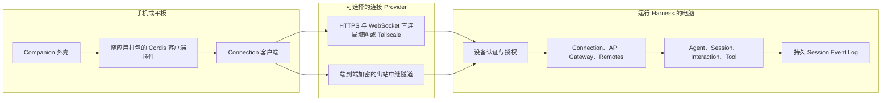

# DSH Companion 架构

[English](architecture.md) | 中文

状态：架构基线；Viewer／Owner 访问、可安装 PWA 与 Android 打包已实现

工程规则与编码前设计步骤分别由 [AGENTS.md](../AGENTS.md) 和 [设计与开发流程](design-workflow.zh.md) 持有。视觉切片见 [待处理事项移动工作流决策](../.agents/notes/implemented/feature/2026-08-15-attention-workflow-first-slice.md)、[对话优先移动界面决策](../.agents/notes/implemented/feature/2026-08-18-conversation-first-mobile-ui.md)和[Host 同步 Session 控件决策](../.agents/notes/implemented/feature/2026-08-19-host-synchronized-session-controls.md)；可信手机路径由 [Host 同源 PWA 决策](../.agents/notes/implemented/architecture/2026-08-16-trusted-host-served-pwa.md)、[可信 Interaction 应答决策](../.agents/notes/implemented/feature/2026-08-16-trusted-interaction-answering.md)、[可信 Session 排队输入决策](../.agents/notes/implemented/feature/2026-08-16-trusted-session-prompt.md)、[Owner 官方客户端转交决策](../.agents/notes/implemented/architecture/2026-08-16-official-owner-client.md)、[可安装 PWA 与 Capacitor 决策](../.agents/notes/implemented/architecture/2026-08-17-installable-pwa-and-capacitor-android.md)、[原生新建 Session 决策](../.agents/notes/implemented/feature/2026-08-18-native-new-session-conversation.md)和[原生断线恢复决策](../.agents/notes/implemented/bug-fix/2026-08-18-native-offline-retry-preserves-pairing.md)共同记录。

## 1. 目标

DSH Companion 是 DeepSeek Harness 的移动优先客户端。它让用户可以监督电脑上持续进行的工作：查看 Session、响应待处理事项、发送或排队输入、向运行中的 Turn 追加指令、停止任务以及检查结果。

Companion 不执行 Tool、不挂载 Workspace、不持有模型凭据，也不实现 Agent Loop。这些职责继续属于 Harness。该分工让文件系统和进程访问留在项目所在的电脑上，并让 Harness Session Log 始终作为权威记录。

## 2. 架构决策

初始设计确定以下决策：

1. Companion 使用 Harness 面向应用的 Remote 与 Gateway API。ACP 继续作为自动化互操作协议，不作为手机端展示协议。
2. 第一个产品形态是由 Host 提供的响应式 Web 应用。在为独立客户端准备远程协议期间，Host 与 Web 客户端产物一起发布。
3. 原生应用通过轻量 Capacitor 外壳复用相同的 Web 功能包。初始计划不包含 React Native 或 Flutter 重写。
4. 第一种传输方式是在局域网或 Tailscale 中通过认证的 HTTPS 与 WebSocket 直连。公网中继是后续可选能力。
5. 手机端首页是 Session 工作区；收件箱保留为跨 Session 待处理事项的辅助入口。
6. 原生版本将可执行插件代码随签名应用一同打包。Host 只发送能力数据，不向原生客户端下发任意 JavaScript。
7. 认证、授权、传输、通知和 UI 功能分别由不同插件负责。

## 3. 系统边界

### 3.1 Harness Host

Harness 负责：

- Agent 的创建、生命周期、执行、取消和继续。
- 只追加的 Session Event Log 及其所有派生投影。
- Tool、审批、问题、权限策略、Job、Goal 和 Workflow。
- Workspace、文件系统、子进程、终端和模型提供方访问。
- 持久设备记录、Viewer／Owner 访问级别和撤销。
- 每个客户端操作的校验与授权。

### 3.2 Companion 客户端

Companion 负责：

- Host 发现与配对交互。
- 配对页面的临时内存与连接状态。浏览器 JavaScript 永远收不到可复用设备凭据。
- 可以丢弃并重新构建的本地展示缓存。
- Viewer 手机导航、待处理收件箱、对话展示和输入。
- Harness 官方客户端的移动布局 Contribution。
- 二维码扫描、通知、相机输入、深层链接和安全存储的原生适配器。
- 根据 Host 能力激活随应用打包的客户端插件。

### 3.3 可选中继

中继负责连接会合和不透明消息转发。它不持有 Agent 状态，不授权 Harness 操作，也不接收提示词、Session Event、Tool 数据、Diff 或 Workspace 数据的明文。

## 4. 部署拓扑



### 4.1 Host 提供的 Web 模式

Harness 从与 API 相同的可信 Origin 提供 Companion Web 资源和启动清单。该模式与当前 Host 版本绑定，是获得可用预览最快的路径。它复用现有浏览器 Connection 载体：单次操作使用 HTTP POST，Host 事件和交互事件的实时下行流使用 WebSocket。

由于 Host 与 Web 产物属于同一部署，Web 构建可以继续使用 Host 选择的浏览器插件图。生产 PWA 在启用非回环地址访问前，仍然必须完成设备认证。

官方 Client Runtime 启动前，Harness Web 入口读取当前设备。回环浏览器和认证 Owner 启动由 Host 选择的官方插件图；Viewer 与未认证浏览器进入 `/companion/`。Companion 会在自己的 Runtime 前解析设备信任，对明确的 `device-unauthorized` 显示配对说明，并把 Owner 送回官方根路径。网络、协议和非预期授权失败仍然属于启动错误。

PWA 安装入口是 `/companion/?install=1`。该入口在设备信任和 Client Runtime 之前捕获浏览器安装请求，不读取认证状态或发送 Harness 请求，因此已提升的 Owner 不会在浏览器完成安装前跳到使用 Harness Manifest 的根页面。入口先绕过静态缓存确认 Tailscale Origin 在线。接受 Chrome 安装对话框只会开始一次安装事务，不能证明 Android 已经提供可用的桌面入口；只有 Manifest 自身关联查询返回已安装 Web App，或该事务之后的独立显示模式启动证明新入口能够打开，浏览器标签页才报告完成。安装后的 `start_url` 仍是 `/companion/`；Manifest 作用域覆盖根路径，Owner 随后可以在独立窗口中进入官方客户端。

### 4.2 原生模式

Capacitor 8 Android 工程使用相对资源路径打包同一个 React/Vite Entry。原生启动先使用 Android Keystore 中不可导出的 P-256 密钥认领配对 Offer 或认证已保存设备，再为共享 Runtime 提供原生 Connection 载体。签名 Challenge 只换取内存短会话；每条 WebSocket 使用单独的一次性握手 Ticket。App 不读取浏览器设备 Cookie，也不保存 Harness Credential、模型 Credential、原生会话或 WebSocket Ticket。

原生认证完成后，签名应用打包外壳、Cordis 运行时、功能插件、通用 Renderer 与平台 Provider。Host 在就绪握手中返回带版本的能力清单。客户端激活兼容的本地插件，并为已经识别但缺少专用 Renderer 的数据使用通用展示。Reachability 失败只进入可重试的连接错误状态，不删除持久配对；清除 Host Origin、设备 id 与 Keystore 身份需要用户单独确认。

原生应用不从已配对 Host 下载可执行插件包。这样既能限定应用审核范围，也能防止遭入侵的 Host 替换应用代码。

### 4.3 中继模式

Host 与 Companion 都向中继建立出站连接。配对过程在两台设备之间建立端到端 Session Key；中继只转发加密 Envelope 和有限的路由元数据。中继可用性不会削弱 Host 授权：每个解密后的请求仍然必须经过与直连请求相同的认证主体和访问级别检查。

第一个版本不需要中继模式。Tailscale 或其他私有网络可以为直连提供可达性，无需增加一个保存密文和连接元数据的服务。

## 5. 插件架构

所有用户可见功能和随部署变化的行为都通过 Cordis 插件组合。App Shell 除了启动客户端 Loader 和展示启动错误外，不决定产品功能。

### 5.1 Companion 仓库职责

当前仓库结构如下：

```text
apps/
  android/                   Capacitor 8 配置、生成的 Android 源码和原生资源组合
  web/                       Harness Client 插件图和响应式 Web 入口
packages/
  host-web/                  回环限制的 /companion 静态资源 Host 插件
  device-trust-web/          不依赖 React 的配对 HTTP 客户端与 Cordis Service
  ui-shell/                  Route Registry、Session 侧栏与响应式抽屉 Shell
  ui-inbox/                  从 Harness SessionListState 派生的收件箱
  ui-pairing/                Runtime 启动前的手机配对页
  ui-session/                Workspace 选择、Session 对话、输入、停止与 Interaction 界面
  ui-settings/               配对 Offer、设备列表、撤销与访问级别管理
scripts/
  build-android-debug.mjs    跨平台 Gradle Debug APK 启动脚本
  build-android-release.mjs  已签名 Universal APK 与 SHA-256 产物脚本
  verify-harness.mjs         精确 checkout 与版本校验
  start-harness.mjs          生成 patch 并启动 dsh web
docs/
  architecture.md
  architecture.zh.md
  mobile.zh.md
```

预发布开发通过相邻的 Harness checkout 消费公开 Package，并锁定精确版本与提交。Companion 不再拥有 Stage 0 的 Connection DTO、Fixture Provider 或 Session Runtime；无密钥测试使用 Harness 官方 Fixture。

### 5.2 Harness 仓库职责

以下安全与协议工作属于 `deepseek-harness`，不属于 Companion。设备信任、Viewer／Owner Endpoint 策略、认证操作者来源和幂等修改处理继续由 Harness 持有；其余是后续能力：

- 在 `host.describe` 中增加协议版本和能力字段。
- 提供一个可发布、只包含线协议的客户端契约，其中包含 DTO 类型、Parser、错误码和载体接口。
- 独立客户端重连所需的事件重放或新基线机制。
- 通知 Service Definition 和 Host 端待处理事件 Consumer。
- 可选的出站中继 Connection Provider。

Companion 必须消费这些契约，不能复制 Host 请求 Schema 并形成第二个事实来源。

### 5.3 能力接缝

每项新的 Harness 能力都必须完整覆盖三个角色。

| 能力 | Service Definition | Provider | Consumer |
|---|---|---|---|
| 设备信任 | 验证设备主体、查看访问级别、撤销信任 | 同时保存浏览器凭据摘要与原生 P-256 公钥的本地 Provider | Connection 认证与授权 |
| 远程载体 | 传输经过认证的请求、响应和下行 Envelope | HTTP/WebSocket 直连；出站中继 | API Gateway 与事件传递 |
| 通知 | 向已注册设备发送不含敏感信息的待处理信号 | Web Push；APNs/FCM 适配器；禁用 Provider | 审批、问题、失败和 Turn 完成事件投影器 |

所有注册都通过 Effect 完成，并在插件卸载时撤销。新行为接入 Connection、Remote、Session Event 和 Interaction 扩展点，不修改 Agent Loop。

## 6. 客户端组合

客户端分为四层：

1. Shell Kernel：启动模块目录、Cordis Loader、错误界面和根 Renderer。
2. 无 React 依赖的 Runtime：负责 Host 连接、Session 对象、Projection、历史窗口、缓存和 Slot 数据源。
3. 功能插件：提供收件箱条目、Conversation Node、Tool View、Command、Job、Goal、Model、Attachment 和 Settings 界面。
4. 平台插件：实现 Web 或 Capacitor 的存储、通知、二维码扫描、相机输入、深层链接和应用生命周期访问。

功能插件依赖能力接口和 UI Slot，而不直接依赖 Capacitor。平台相关行为通过注入提供，使相同的功能 Package 可以运行在电脑浏览器、手机浏览器和原生 WebView 中。

## 7. 协议要求

独立发布的客户端不能继续依赖 Host 与 Client 总是同时发布的假设。就绪响应至少必须包含：

```ts
interface CompanionHostDescription {
  protocol: {
    major: number
    minor: number
  }
  host: {
    id: string
    name: string
  }
  capabilities: Array<{
    id: string
    version: number
  }>
  principal: {
    deviceId: string
    access: 'viewer' | 'owner'
  }
}
```

准确类型属于 Harness 线协议契约的所有者。该示例只记录必需信息，不代表最终字段名。

### 7.1 兼容性

- 协议主版本不同时，在请求 Session 数据前失败。
- 主版本相同且所有必需能力兼容时，可以接受更高的次版本。
- 缺少可选能力时，隐藏或替换拥有该能力的 UI Contribution。
- 未知能力 ID 可以作为数据保留，但不能激活代码。
- 业务错误继续保持类型化，并与载体、认证和兼容性错误区分。

### 7.2 请求

每个修改状态的请求都携带客户端生成的幂等键。响应丢失后重复请求时，Host 必须返回原始结果或稳定冲突，不能重复提交同一条 Prompt、审批或 Command。

认证后的 Connection 提供设备主体。业务 Payload 不接受由调用方自行指定的 `deviceId` 或访问级别。

### 7.3 事件传递与恢复

实时流使用由 Host 流实现拥有的不透明恢复游标。重连时，Host 要么从该游标之后继续，要么要求客户端用新基线替换本地状态。客户端不能假设只接收后续事件就能修复未知缺口。

Session Event 保留其权威序号。Projection 更新继续采用较高序号优先。待审批和待回答问题使用稳定请求 ID 和明确的 resolved 事件，使重连重放不会重新创建已在其他客户端处理的操作。

## 8. 身份、配对与授权

### 8.1 配对流程

1. Harness 回环页面使用配置的私有 HTTPS Origin 创建一个有效期很短的一次性配对 Offer。
2. 页面显示包含 Host Origin 与随机 Offer id 的二维码，其中没有可复用设备凭据。
3. 手机提交设备名称，得到 Claim Secret 与六位验证码。Claim Secret 只保留在页面内存中。
4. 电脑列出待处理 Claim，操作员核对验证码后批准。
5. 手机携带 Claim Secret 轮询；浏览器 Claim 设置 Host-only、Secure、HttpOnly、SameSite=Strict Cookie，原生 Claim 保存提交的 P-256 公钥且不返回持久 Bearer。
6. Offer 重用、过期、Claim Secret 不匹配、凭据无效和撤销均安全失败。Poll 响应丢失时可在 Offer 有效期内重试。

同源 PWA 使用标准 HTTPS Cookie 与 WebSocket 行为。原生客户端用 Android Keystore 签署带版本的单次 Challenge，把短会话保留在内存，并为每条 WebSocket 领取一次性 `Sec-WebSocket-Protocol` Ticket。Harness 只持久化原生公钥与当前访问级别。

### 8.2 访问级别

每台已配对设备只有一个完整访问级别：

| 访问级别 | 允许的操作 |
|---|---|
| `viewer` | 使用 Companion 列出 Session，并读取 Transcript 与有界实时 Projection |
| `owner` | 使用 Harness 官方 Web 客户端完成除 `local-only` Host 原生操作以外的浏览器工作流 |

新配对设备是 Viewer。只有回环管理操作可以把单台设备提升为 Owner 或降级，提升前必须警告手机可以运行命令、修改 Workspace、控制 Session 与 Interaction，并更改 Settings 和 Credential。Connection 把每个 Endpoint 分类为 `viewer`、`owner` 或 `local-only`；未知 Endpoint 按本机专用安全失败。原生文件选择器、路径打开和配置文档打开方法保持本机专用，因为它们的交互会显示在电脑上。

### 8.3 撤销与来源记录

Harness 拥有可信设备列表。本地操作员可以立即撤销设备；与该设备关联的所有活动连接和待处理请求随即终止。

每个远程 Prompt、Command、中途指令、审批决定和回答，都要在已经表示该操作的持久事件中记录经过认证的操作者来源。模型可见输入必须能够从 Session Log 重建，其中包括来源设备。Secret 和原始认证材料永远不能进入 Session Event。

## 9. 安全模型

设计需要处理以下威胁：

- 同一局域网中的未配对设备可以访问 Host 网络地址。
- DNS Rebinding 或跨 Origin 浏览器请求以 Host API 为目标。
- 中继或反向代理观察或修改流量。
- 被截获的二维码在配对完成或过期后被重放。
- 已配对手机丢失后被撤销。
- 两个客户端竞争回答同一项审批或问题。
- 某个客户端处理请求后，另一个客户端才打开过期通知。
- 遭入侵的 Companion 缓存中保留旧 Session 内容。

安全规则：

- 保留网络可达性检查，但绝不以此代替认证。
- 生产直连使用 HTTPS/WSS，包括 Tailscale Serve 等私有网络 HTTPS 端点。普通 HTTP 仅限回环地址开发环境。
- 中继 Payload 使用带重放保护的端到端认证加密。
- 每个请求都使用 Connection 主体、设备当前访问级别和 Endpoint 策略执行权限检查。
- Push Payload 只携带不透明的 Host、Session 和待处理事项标识，以及粗粒度类别。应用打开后重新获取当前状态。
- 通知绝不包含 Prompt、Tool 参数、Diff、路径、模型输出或 Credential。
- PWA 接收应用 JavaScript 无法读取的 HttpOnly Bearer Cookie。Android 在 Keystore 保存不可导出的 P-256 私钥，派生会话只存在于内存。
- Transcript 缓存应尽量减少；需要保留时使用平台存储加密，并且可以安全丢弃。
- Settings 与 Credential 需要 Owner 访问；Host 原生对话框和配置文档打开操作保持本机专用。

## 10. 状态所有权

Harness 是所有产品状态的权威来源。Companion 可以持久保存：

- 已配对 Host 描述和公开身份指纹。
- 原生设备身份保存在平台安全存储。Android App 只持久化 Keystore 密钥，以及非敏感的 Host Origin、设备 id 与名称；当前 PWA 不通过应用代码保存认证 Secret。
- 不含 Secret 的 UI 偏好。
- 有界的加密展示缓存和最后确认的恢复游标。
- 带幂等键的本地草稿和未发送操作。

Companion 不保存模型 Credential、Host Settings 文档、默认权限、完整 Workspace Tree 或独立的 Session Event Log。

应用从挂起状态回到前台时，将当前连接视为已断开；重新认证并完成恢复或获取新基线后，才重新启用操作。这与移动操作系统在后台挂起 WebSocket 的行为相容。

## 11. 移动端信息架构

### 11.1 主导航

第一个版本包含三个顶层入口，根路径默认进入 Session：

- Session：按 Host 分组展示 Session 列表，并区分运行中、空闲、失败和需要处理状态。
- 收件箱：展示所有已配对 Host 中的审批、问题、计划审阅、失败和新完成 Session。
- 设置：Host 配对、设备信任、通知、外观和诊断。不提供 Harness 模型 Credential 或插件配置。

### 11.2 Session 页面

Session 页面包含：

- 从 Host 已注册 Workspace 创建或复用空白 Session 的 Owner 入口。
- 紧凑展示的 Host、Workspace、Session、Model 和权限上下文。
- 流式 Conversation 和结构化 Tool 展示。
- 根据当前 Agent 状态支持提交、排队和中途追加指令的输入区。
- 明确的中断和重试操作。
- 内联审批、问题和计划审阅输入区。
- 后续加入的有界 Diff 与产出文件 Review 标签页。

手机布局只使用一个主面板。Session 详情隐藏全局品牌栏和底部导航，由紧凑会话顶栏、占满剩余高度的 Conversation 和底部常驻输入区组成；返回 Session 列表后恢复三个顶层入口。平板和桌面视口可以在 Conversation 旁显示 Session 导航，但继续使用相同的插件和状态所有者。

Conversation Renderer 遵循 Harness 网页客户端的内容层级：用户输入作为字面文本显示在右侧气泡中，Agent 正文使用共享 `ui-primitives` Markdown Renderer，Reasoning 与 Tool 活动使用紧凑的可展开轨迹行。已完成 Tool 调用只与权威结果一起显示一次。一体化 Composer 从 Host 动态加载命令、权限 Projection、模型目录与模型提供的推理强度，并通过 Harness 既有命令或 Session API 写回；其他电脑或手机客户端重新读取相同 Host 状态。附件仍未接入。

单面板 Session 将待处理审批、问题和计划审阅放在 Conversation 历史之后、Composer 之前，使手机上的确认操作靠近输入区，同时保持历史记录独立滚动。

### 11.3 未知功能

旧版 Companion 可能连接到包含新插件的 Host。未知 Session Event 继续遵守 Harness Session 格式。对于未知的可选 UI 能力，在能够安全展示时使用带标签的通用状态；客户端无法证明如何回答时不提供操作。应用绝不根据未知操作 Schema 自动生成通用修改表单。

## 12. 交付阶段

### 阶段 0：视觉契约

- 使用 Fixture 驱动的响应式 Web 外壳。
- 收件箱、Session 列表、Session Conversation、审批、问题和计划审阅交互演示。
- 在电脑浏览器中使用手机和平板视口测试。
- 不连接远程 Host，也不作出安全性声明。

### 阶段 0.5：回环真实连接（已实现）

- Harness 同源提供 `/companion/`，并保留原有根页面。
- 使用公开 Client Connection、API Remotes 与 Client Runtime 读取真实 Session。
- 从 Host 权威快照派生收件箱，并通过上游 Interaction 应答载体提交问题与审批。
- Host 插件拒绝非 `127.0.0.1` bind 和不一致的 Harness Package 版本。
- 只读 Conversation 历史使用 Harness 标准 Definition 与 Runtime 投影；不提供设备身份、局域网访问、Prompt、排队、中途指令或中断操作。

### 阶段 1：经过认证的只读直连 PWA（已实现）

- 包含二维码配对、Viewer 访问和撤销的设备信任能力。
- 通过局域网或 Tailscale 使用 HTTPS/WebSocket 直连。
- Session 列表、历史、实时只读投影，以及对远程修改的显式拒绝。
- 中文配对、设备管理、访问级别与撤销界面。

### 阶段 1.5a：经过认证的 Interaction 应答（已实现）

- Owner 请求能力开放 `interaction:answer`；新配对设备保持 Viewer。
- 手机端的问题、计划审阅、允许一次和拒绝控件由当前认证访问级别派生。
- 按主体隔离的幂等处理、持久操作者来源、按提交顺序发布的 resolved Frame，以及授权替换或撤销后的请求取消。
- Companion 与官方客户端共享持久 Interaction 来源记录和取消语义。

### 阶段 1.5b：经过认证的 Session 排队输入（已实现）

- Owner 请求能力覆盖 Session Prompt 工作流；新配对设备保持 Viewer。
- 手机向已有普通 Session 提交非空纯文本 Queue Input，并从 Host 权威 Queue 和 Session Event 显示结果。
- Prompt Operation id、持久 Actor 来源、进程内与日志恢复后的重复提交处理，以及授权撤销前的提交检查。
- Companion 为 Viewer 兼容测试保留有界 Queue Composer；Owner 使用官方客户端。

### 阶段 1.5c：经过认证的远程控制（已实现）

- 回环设置在显示完整控制警告后，把单台设备从 Viewer 提升为 Owner。
- 认证 Owner 在 Companion Session Runtime 启动前进入由 Host 选择的官方 Web 插件图。
- 每个旧 API 和 RPC 通道声明 Viewer、Owner 或本机专用；未分类与 Host 原生操作保持本机专用。
- 访问级别替换和撤销会终止活动请求与 Downlink。

### 阶段 2a：可安装 PWA 与 Android 打包（已实现）

- Manifest、主屏幕图标，以及只包含有界静态预缓存的 Companion 作用域 Service Worker。
- 同一 Vite 插件图提供 Host 同源与相对路径 Native 两个构建目标。
- Capacitor 8 Android 源码、品牌自适应图标与启动图，以及同步、Android Studio 和 Debug APK 命令。
- 密钥绑定原生认证成功前不启动任何 Harness Transport 的安全失败入口。
- 浏览器手机视口覆盖安装元数据、缓存范围、现有工作流，以及 390x844 的原生入口。

### 阶段 2b：原生连接与平台能力（部分实现）

- 复用 Harness Runtime、组件、Route 与 Extension Slot 的官方客户端移动布局插件。
- 部署环境支持时启用 Web Push。
- 使用 Capacitor 打包 iOS。
- Android Keystore 身份、签名 Challenge 认证、原生 HTTP、一次性 WebSocket Ticket 与共享 Companion Runtime 已实现。
- 原生 Owner 可以选择 Host 已注册 Workspace、进入 Host 创建或复用的空白 Session、发送第一条消息并停止运行；Viewer、断线和无 Workspace 状态保持不可修改。
- 二维码扫描器、原生推送、相机附件、深层链接、系统分享入口与 iOS Keychain 尚未实现。
- 签名静态客户端插件目录和兼容性降级。

### 阶段 3：可选中继

- Host 出站中继 Provider。
- 带重放保护的端到端加密 Envelope。
- 自托管中继部署。
- 不泄露 Session 内容的 Push 路由。
- 多 Host 选择和连接健康诊断。

### 阶段 4：Review 工作流

- 有界 Diff 和产出文件 Review。
- Review Comment 或结构化 Follow-up Prompt。
- 仅在完成独立授权设计后，加入范围严格受控的 Git 操作。

## 13. 验收要求

每条发布路径都必须证明：

- 在 390x844 和 430x932 视口中没有横向溢出或控件重叠。
- 触摸目标、安全区域 Insets、虚拟键盘尺寸变化和较长的中英文内容均保持可用。
- 下行流断开后可以重连，不会重复消息或重新打开已处理交互。
- 重复发送超时的修改请求不会重复执行操作。
- 过期审批回答和过期通知能够安全失败。
- 撤销会终止该设备当前及后续请求。
- 协议主版本不匹配时，在展示 Session 内容前失败。
- 缺少可选能力时，只移除该能力拥有的功能。
- 中继模式测试可以证明中继无法解密应用 Payload。
- Prompt 和交互操作保留持久、经过认证的操作者来源。

浏览器可见行为通过真实组装的 Playwright 流程验证。Host 能力、认证和生命周期路径在其所属仓库中接受聚焦的单元与集成测试。Harness 中对产品可见的行为也遵守其无密钥 Snapshot 策略。

## 14. 第一个版本明确不做的内容

- 在手机上运行 Harness 或 Tool。
- 将远程桌面或原始终端镜像作为主要协议。
- 未经认证的公网 Host 端点。
- 远程编辑 Harness Credential 或任意插件配置。
- 强制使用托管中继。
- 多用户协作和组织策略。
- 可下载的原生插件代码。
- 离线执行 Agent Turn。

## 15. 开放决策

在获得实现证据前，以下决策有意保持未定：

- Companion Package 的 npm 所有权和名称。
- 配对与中继加密使用的具体标准库。
- 直连发现只使用二维码，还是在配对安全完成后增加 mDNS。
- 中继对加密 Envelope 的保留策略。
- 自托管部署使用的 Push Provider 策略。
- 能够支持独立发布客户端的完整上游 Package 集与协议兼容信息；当前同版本源码组合不构成独立发布承诺。

## 16. 参考实现

- [Happier](https://github.com/happier-dev/happier)：Daemon、中继、多设备连续性、加密同步和待处理收件箱。
- [CC Pocket](https://github.com/K9i-0/ccpocket)：二维码连接、手机审批、弱网恢复、Tailscale 部署以及 Flutter/TypeScript 协议分离。
- [Remodex](https://github.com/Emanuele-web04/remodex)：配对设备身份、经过认证的加密中继通道、重放保护和原生通知。
- [VibeTunnel](https://github.com/amantus-ai/vibetunnel)：响应式浏览器访问和私有网络优先的远程部署。
- [Capacitor](https://github.com/ionic-team/capacitor)：Web 优先的原生打包和平台插件 API。

这些项目只作为设计参考。Companion 复用 Harness 语义，不在 UI 与 Harness 之间引入通用终端或第三方 Agent Bridge。
